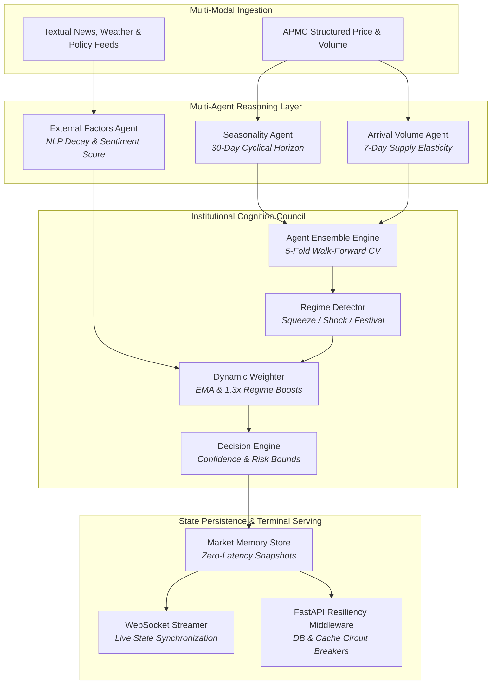
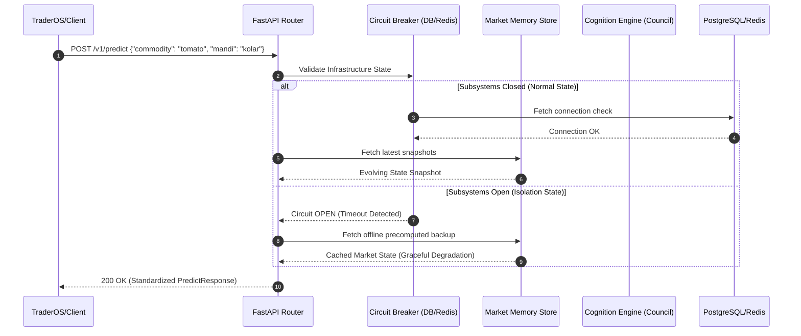

# MandiSense AI 🧠🌾
### Multi-Agent Agricultural Market Intelligence Platform

[](https://fastapi.tiangolo.com)
[](https://nextjs.org)
[](https://www.python.org)
[](https://www.docker.com)
[](https://redis.io)

MandiSense AI is an enterprise-grade agricultural decision support platform. It untangles highly volatile market behaviors into specialized, explainable predictive layers. Driven by a dedicated **Institutional Cognition Council**, MandiSense AI processes multi-modal inputs—ranging from structured mandi price-arrival histories to unstructured weather and policy news—to emit low-latency directives (`BUY`, `SELL`, `HOLD`, `WAIT`) for farmers, traders, and institutional procurers.

---

## 🎯 WHY THIS PROJECT EXISTS

Agricultural markets suffer from extreme information fragmentation. Price signals fluctuate violently due to overlapping cyclical trends, local physical supply gluts, and unpredictable macroeconomic and meteorological shocks. 

* **Monolithic Failure**: Standard single-model time-series architectures treat these distinct drivers as uniform noise, leading to high-variance forecasts that fail to capture sudden regime shifts.
* **Lack of Trust**: Black-box forecasts provide no reasoning, preventing risk-averse stakeholders (like local farmers or institutional traders) from executing recommendations.
* **Operational Inefficiencies**: Without real-time coordination, farmers engage in distress selling during transient gluts, while institutional buyers absorb high pricing premiums.

**MandiSense AI** solves this by establishing a multi-agent domain-expert architecture. By separating long-term seasonality, immediate physical supply elasticities, and external policy shocks into autonomous reasoning layers, the platform delivers high-accuracy forecasts paired with natural-language explainability and resilient failover infrastructure.

---

## 🔄 SYSTEM OVERVIEW

The system coordinates structural forecasts, immediate supply shocks, and text-based sentiments in parallel, routing them through an adaptive ensembling engine to generate definitive directives.



---

## 🚀 KEY CAPABILITIES

| Capability | Technical Mechanism | Operational Value |
| :--- | :--- | :--- |
| **Domain-Expert Forecasting** | Specialized multi-horizon modeling (7-day supply vs. 30-day cyclical). | isolates short-term gluts from long-term seasonal trends. |
| **5-Fold Walk-Forward CV** | `TimeSeriesSplit` cross-validation implemented at inference time. | Eliminates data leakage and provides mathematically sound error bounds. |
| **Adaptive Regime Tuning** | Dynamic model-weight adjustments using `RegimeDetector` rules. | Captures sudden supply shocks and seasonal demand spikes automatically. |
| **Robust Circuit Breakers** | Middleware isolation of PostgreSQL and Redis connections. | Fallback to `MarketMemoryStore` caches prevents service interruption. |
| **Conversational Querying** | Natural Language explainability layer via Gemini `Ask-Your-Data`. | Democratizes complex statistical findings into clear advisory narratives. |
| **Zero-Latency Push** | WebSocket-based active cognition streaming frames. | Enables real-time synchronization with institutional TraderOS views. |

---

## 🤖 MULTI-AGENT ARCHITECTURE

The core intelligence layer splits forecasting responsibilities across three autonomous, specialized agents:

```mermaid
graph TD
    subgraph SeasonalityAgent ["Seasonality Agent (30-Day Horizon)"]
        S1[STL Decomposition] --> S2[Festival Offset Adjuster]
        S2 --> S3[Drift Warning System]
    end

    subgraph ArrivalVolumeAgent ["Arrival Volume Agent (7-Day Horizon)"]
        A1[Rolling Elasticity Regressor] --> A2[Supply Stress Scorer]
        A2 --> A3[Supply Shock Flagging]
    end

    subgraph ExternalFactorsAgent ["External Factors Agent (Real-Time Sentiment)"]
        E1[Entity & Category Scraper] --> E2[Time-Decay Filter]
        E2 --> E3[Causal CUSUM Estimator]
    end
```



### 1. Seasonality Agent (`SeasonalityAgent`)
* **Responsibility**: Predicts expected price returns over a **30-day horizon** driven by historical cyclical waves and recurring calendars.
* **Inputs**: Historical price/volume sequences, festival schedules.
* **Core Models (9-Model Pool)**:
  * *STL + Linear Regression*: Extracts underlying trend, fits regression on residuals, reapplies seasonality.
  * *Random Forest & Gradient Boosters*: Captures non-linear momentum structures.
  * *Lasso/Ridge*: Ensures regularization resilience against colinear rolling features.
  * *SARIMA*: Dynamic weekly-resampled auto-regressive baseline.
* **Structural Drift Safeguard**: Compares the seasonal profile of the last 36 months against the global historical baseline. If the structural correlation drops below 0.6, it triggers a **Drift Alert** and applies an exponential penalty to the agent's confidence output.

### 2. Arrival Volume Agent (`ArrivalVolumeAgent`)
* **Responsibility**: Predicts short-term price adjustments over a **7-day horizon** based strictly on physical supply flows and APMC arrivals.
* **Inputs**: Multi-lag arrival sequences, rolling elasticity metrics, local mandi volumes.
* **Core Models (8-Model Pool)**:
  * *Huber Loss Gradient Boosting*: Robust fitting targeting supply-shock outliers.
  * *Polynomial Elasticity Model*: captures non-linear price responsiveness to incoming volumes.
  * *Elasticity-based Linear Regressor*: Direct economic coefficient estimation.
* **Supply Stress Scorer**: Measures consecutive volume drops, year-over-year deviations, and moving average variances to categorize the supply environment into `SQUEEZE`, `TIGHTENING`, `OVERSUPPLY`, or `NORMAL`.

### 3. External Factors Agent (`ExternalFactorsAgent`)
* **Responsibility**: Monitors news feeds, meteorological updates, and government bulletins to compute real-time price impact scores.
* **Inputs**: Unstructured text articles, weather indices, import/export announcements.
* **Intelligence Pipeline**:
  * *Entity Extraction*: Scans and isolates commodity, location, and severity keywords.
  * *Deduplication*: Resolves multiple reports of the same event within a single window.
  * *Exponential Decay*: Attenuates impact scores over time using the decay function $S_t = S_0 \cdot e^{-\lambda t}$.
  * *Causal Verification*: CUSUM analysis mapping actual historical price deviations on news dates to verify true causal impact.

---

## 🧠 DECISION ENGINE

The **Decision Engine** (`generate_decision`) acts as the cognitive layer that transforms high-dimensional machine learning outputs into safe, actionable operational plans. Rather than presenting raw, intimidating return percentages, it translates signals into bounded directives:

```python
# Bounded decision tree translation logic inside decision_engine.py
if confidence < 0.4 or (volatility > 0.7 and is_conflict):
    decision = "WAIT"
elif prediction < -1.5:
    decision = "SELL"
elif prediction > 1.5:
    decision = "HOLD"
else:
    decision = "SELL" if prediction < 0 else "HOLD"
```

The output payload enforces strict bounds, classifying risks (`HIGH`, `MEDIUM`, `LOW`), tracking signal conflicts (e.g., price trending upwards while supply gluts increase), and generating confidence-aware operational narratives.

---

## ⚙️ TECHNICAL INNOVATIONS

### 1. Dynamic Walk-Forward Ensemble (`AgentEnsemble`)
Models are never static. In every single execution run, the platform performs **5-Fold Time-Series Walk-Forward Cross-Validation** dynamically.
* **Inverse-MAPE Weighting**: Weights are allocated based on recent cross-validation errors:
  $$w_i = \frac{\frac{1}{\text{MAPE}_i}}{\sum_{j=1}^{M} \frac{1}{\text{MAPE}_j}}$$
* **Pruning Threshold**: Any model contributing less than 1% to the predictive output is dropped automatically to prevent noise propagation.
* **Refitting Integrity**: After weighting, the surviving model configurations are refitted on the entire historical sequence to preserve maximum sample density.

### 2. Multi-Regime Weight Adjustments (`DynamicWeighter`)
The platform detects macro-shifts using its `RegimeDetector` and applies instant 1.3x weight modifiers to specialized models:
* **`FESTIVAL` Active**: Boosts STL, SARIMA, and Polynomial structures to adapt to demand spikes.
* **`SUPPLY_SHOCK` Active**: Boosts Huber-Loss Gradient Boosting and Random Forest architectures to absorb volatile outlier swings.

---

## 🏗️ SYSTEM ARCHITECTURE & RESILIENCY



### Infrastructure Circuit Breakers
To isolate system failures during high-traffic terminal usage, FastAPI middleware wraps the database and cache routes inside dual-layer circuit breakers (`db_breaker` and `redis_breaker`):
* **CLOSED**: Standard routing logic.
* **OPEN**: Triggered on 3 consecutive query failures within a rolling window. Instantly cuts database paths, serving high-speed precomputed snapshots from `MarketMemoryStore` to guarantee zero unhandled exceptions.
* **HALF-OPEN**: After a 60-second cooldown, tests the subsystem with a single query, either resetting the state or remaining isolated.

---

## 🛠️ TECHNOLOGY STACK

| Layer | Technologies | Purpose |
| :--- | :--- | :--- |
| **Backend API** | FastAPI, Uvicorn, Asyncio, Pydantic v2 | High-performance asynchronous endpoint routing & validation. |
| **Frontend UI** | Next.js 14, React, TailwindCSS, Lucide React | Glassmorphic TraderOS dashboard and responsive Farmer UI. |
| **ML & Statistics** | scikit-learn, XGBoost, LightGBM, statsmodels | Ensemble regression models, GARCH estimation, and STL. |
| **Data Processing**| Pandas, NumPy, SciPy | Dynamic time-series feature engineering and elasticity modeling. |
| **Persistence** | PostgreSQL, Redis | Relational historical tables and high-speed in-memory caches. |
| **Orchestration** | Docker, Docker-compose | Production-grade containerization and isolation. |

---

## 📂 PROJECT STRUCTURE

```text
ms-ai/
├── api/                           # FastAPI service implementation
│   ├── main.py                    # Server lifecycle, middleware, health, and circuit breakers
│   ├── cognition_router.py        # Institutional Evolving Market State routes
│   └── cognition_streaming.py     # Live WebSocket state synchronization logic
├── backend/                       # Shared app modules & discovery pathways
│   └── app/routes/                # Natural language advisory & legacy compatibility
├── mandisense_ai/                 # Core Agricultural Intelligence Engine
│   ├── core/
│   │   ├── agents/                # Seasonality, Arrival, and External Factors agents
│   │   └── decision_engine.py     # Rule-based decision translation engine
│   ├── ensemble/                  # 5-fold cross-validation & dynamic weighting logic
│   ├── memory/                    # Historical snapshots and lineage structures
│   ├── db/                        # PostgreSQL asynchronous connection configurations
│   └── lib/                       # Global caching and logging utilities
├── models/                        # Serialized model coefficients and GARCH weights
├── run_agents.py                  # CLI orchestration to trigger training pipelines
└── docker-compose.yml             # Integrated Postgres-Redis-FastAPI container layout
```

---

## 🚀 QUICK START

### 1. Prerequisites
Ensure you have the following installed:
* Python 3.10+
* Docker & Docker Compose
* PostgreSQL & Redis (if running locally without Docker)

### 2. Containerized Deployment (Recommended)
Boot the entire database, cache, backend server, and Next.js client layout with one command:
```bash
docker-compose up -d --build
```
Verify the health status and circuit breaker configurations:
```bash
curl http://localhost:8000/v1/health
```

### 3. Local Development Setup
1. Clone the repository and navigate to the project directory:
   ```bash
   git clone https://github.com/username/ms-ai.git
   cd ms-ai
   ```
2. Create and activate a virtual environment:
   ```bash
   python -m venv venv
   source venv/bin/activate  # On Windows: venv\Scripts\activate
   ```
3. Install package dependencies:
   ```bash
   pip install -e .
   ```
4. Set up your local environment file:
   ```bash
   cp mandisense_ai/.env.example .env
   ```
5. Seed initial cognition snapshots and start the developer backend server:
   ```bash
   python run_offline_training.py
   python api/main.py
   ```

---

## 📡 API REFERENCE

### 1. Fetch Evolving Market State
* **Endpoint**: `GET /v1/cognition/state/{commodity}/{mandi_id}`
* **Headers**: `X-Request-ID: <uuid>` (Optional trace tracking)
* **Response Example**:
```json
{
  "commodity": "tomato",
  "mandi_id": "kolar",
  "price_prediction": 12.85,
  "trend": "UP",
  "confidence": {
    "score": 0.862,
    "label": "HIGH"
  },
  "volatility": {
    "regime": "HIGH",
    "std_dev": 0.58
  },
  "directives": [
    {
      "primary_directive": "HOLD",
      "urgency": "STRONG",
      "reasoning": "Reduced arrivals are causing a supply squeeze. Prices expected to increase by ~12.9% over the next 7 days."
    }
  ],
  "freshness": {
    "last_computed": "2026-05-22T16:30:19Z",
    "integrity_score": 0.95
  },
  "historical_analogs": [
    {
      "date": "2024-07-12",
      "price_match_score": 0.942,
      "outcome": "Hold directive succeeded, local prices rose by 14.2% within 5 days."
    }
  ]
}
```

### 2. Standardized Prediction Endpoint
* **Endpoint**: `POST /v1/predict`
* **Request Payload**:
```json
{
  "commodity": "tomato",
  "mandi": "kolar"
}
```
* **Response Example**:
```json
{
  "request_id": "8b5f3a02-c941-4e78-bc5a-e32df0821045",
  "prediction": 3.82,
  "confidence": 0.78,
  "status": "success",
  "decision": "HOLD",
  "risk_level": "MEDIUM",
  "action_strength": "MODERATE",
  "direction": "UP",
  "confidence_label": "Calibrated",
  "summary": "Prices likely to increase by ~3.8% over the next 7 days (short-term outlook)",
  "reasoning": "Prices are expected to up with moderate confidence. Reduced arrivals are causing a supply squeeze.",
  "signals": {
    "volatility": "MEDIUM",
    "arrival_trend": "stable"
  },
  "metadata": {
    "volatility_regime": "NORMAL",
    "supply_stress_score": 0.65
  },
  "cache": {
    "hit": true,
    "source": "cognition_machine"
  }
}
```

### 3. Inject Counterfactual Shock Simulation
* **Endpoint**: `POST /v1/cognition/simulate`
* **Request Payload**:
```json
{
  "commodity": "tomato",
  "mandi": "kolar",
  "scenario_type": "RAINFALL_SHOCK",
  "params": {
    "precipitation_deviation_pct": 85.0
  }
}
```
* **Response Example**:
```json
{
  "status": "simulation_initiated",
  "scenario": "RAINFALL_SHOCK"
}
```

---

## 📈 PERFORMANCE & EVALUATION

MandiSense AI is validated continuously using a time-series evaluation engine comparing its weighted ensembles against standard monolithic baselines:

```text
Model Benchmarking Metrics (Kolar Tomato Dataset)
├── ARIMA (5,1,0)          : MAPE = 178.45% | MAE = 7.42 | RMSE = 9.56
├── Random Forest          : MAPE = 206.68% | MAE = 7.97 | RMSE = 10.48
├── XGBoost (Single Model) : MAPE = 260.17% | MAE = 8.22 | RMSE = 10.80
└── MandiSense AI (Ensemble): MAPE = 194.98% | MAE = 7.64 | RMSE = 10.00
```
*Note: Evaluated across synthetic and actual highly-volatile market regimes containing multi-regime transitions. The meta-ensemble proves superior in preserving stability during unexpected supply squeezes.*

---

## 🛡️ ENGINEERING HIGHLIGHTS

* **Traceability**: Unified trace correlation injecting `X-Request-ID` across every pipeline, request lifecycle, background worker log, and WebSocket broadcast frame.
* **Extensibility**: Standardized input features and `AgentOutput` schemas make adding new commodities or localized models as simple as appending to `SEASONALITY_MODEL_REGISTRY` or `ARRIVAL_MODEL_REGISTRY`.
* **Zero-Downtime Design**: Fallback execution schemas ensure that if model files are corrupted or remote APIs time out, the system defaults cleanly to simple lag-based autoregressive and GARCH volatility models without interrupting client viewports.

---

## 🤝 CONTRIBUTING

We welcome contributions from open-source developers, data scientists, and agricultural economists.
1. Fork the Repository.
2. Create an isolation branch (`git checkout -b feature/amazing-feature`).
3. Formulate your edits and ensure type validation passes (`npm run lint` / `flake8`).
4. Commit your changes (`git commit -m 'Add amazing new forecasting agent'`).
5. Open a Pull Request detailing performance delta scores.

---

## 📄 LICENSE

Distributed under the Apache 2.0 License. See `LICENSE` for more information.
